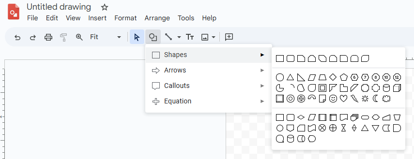

# Experiencing Fubo

For this class we were introduced to Fubo as a wireframe creation software. Some common features contained within the software 
include creating widgets and templates of items (to make them reuaseable) for easy construction of different views.

In other programs like Photoshop or Google Drawings, there is a pretty well defined way to select shapes or predefined items to
place on the screen. From these experiences I have an built up an **expectation** on how this process should
function, mainly where the buttons are located within the design of the interface. As seen here,

